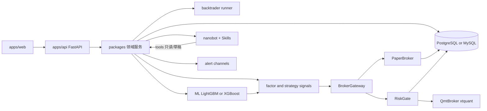
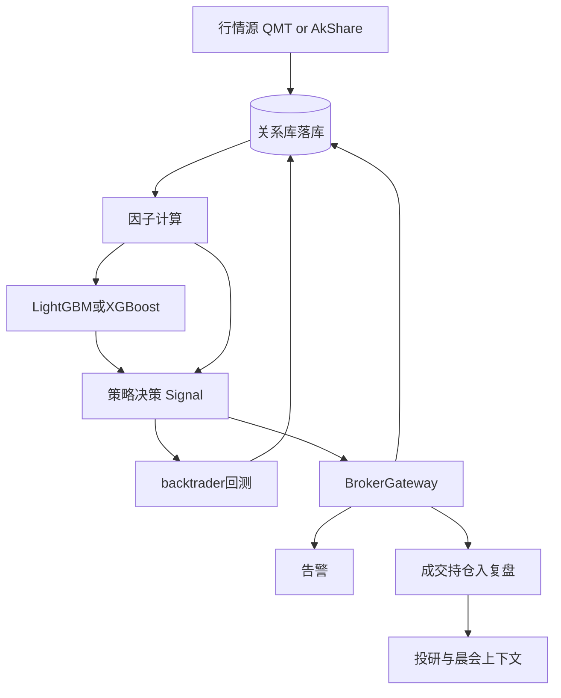

# 个人 AI 量化交易系统 — 全量实施计划

> I'm using the writing-plans skill to create the implementation plan.

**Goal:** 在空仓库 `E:\study\AiMakeMoney` 落地一套本地优先、模块齐全的个人 AI 量化工作台，覆盖你列出的全部能力。

> **范围状态：v1 已冻结（2026-07-14）**  
> 以下功能与技术选型作为首版基线实施；新增需求按变更单独评审，不默认并入当前 Phase。设计稿：`docs/product-design-draft.html`（v0.6）。

**Architecture:** Python FastAPI 领域服务 + React 仪表盘；业务数据落关系库（默认 PostgreSQL，可切 MySQL）；回测 backtrader；指标 TA-Lib；ML 可切换 LightGBM/XGBoost；BrokerGateway 切模拟/实盘；飞书告警。**投研对话单独采用 nanobot Agent 运行时 + 自建 Skill（`SKILL.md`）**；底层 LLM 仍可切换 OpenAI / DeepSeek / ChatGPT；工具默认只读，禁止对话直投下单。其余模块不改为 nanobot。

**Tech Stack（已锁定，不再二选一）:**

- 市场：**A 股 + ETF**
- 运行：**Windows 本地优先**（适配 miniQMT）
- 后端：Python 3.11+ / FastAPI / APScheduler
- 前端：React + Vite + ECharts（或 Lightweight Charts）
- **存储（关系库为真相源）:**
  - 默认 **PostgreSQL 16+**（`DATABASE_URL=postgresql+psycopg://...`）
  - **MySQL 8+** 通过同一套 SQLAlchemy 模型切换（`DATABASE_URL=mysql+pymysql://...`）；方言差异用 Alembic/类型抽象消化，业务代码不绑死单一驱动
  - ORM：SQLAlchemy 2.x + Alembic 迁移
  - **必须落库：** 行情（日/分钟 OHLCV、快照）、板块/概念成分、自选、**打板情绪日表**、**龙虎榜明细**、**交易日历**、**停牌/复牌事件**、**模拟盘账户/持仓/成交/资金流水**、实盘订单与持仓镜像、策略元数据、告警记录、复盘笔记、回测报告元数据、**知识库文档元数据**
  - **可文件系统：** ML 模型二进制（`data/models/{engine}/{model_id}/`，engine=`lightgbm`|`xgboost`）；研报/笔记原文与切片（`data/knowledge/`）；库内存 `doc_id`、标签、向量索引引用
- 行情/交易：miniQMT `xtquant` 为主；AkShare 补历史与龙虎榜/涨停池等；写入 DB 后再被监控/回测/模拟/晨会消费
- **回测：`backtrader` 为唯一回测内核**（日/分钟 bar）；DataFeed 从 DB 查询装载为 `PandasData`；报告摘要写回 DB
- **技术指标：`TA-Lib`（Python 包 `TA-Lib`）** 为策略/因子/监控指标的标准计算库；Windows 安装需匹配本机 Python 的二进制 wheel 或官方 C 库
- **机器学习：同时支持 `lightgbm` 与 `xgboost`，通过 `ML_ENGINE`（或训练任务级 `engine` 字段）切换**
  - 统一抽象：`ModelBackend`（`fit` / `predict` / `save` / `load` / `feature_importance`）
  - 实现：`LightGbmBackend`、`XgboostBackend`；特征矩阵与标签协议相同，方便同数据集对比两引擎
  - 训练产物版本化落盘并写 `ml_models.engine`；推理时按模型记录的 engine 加载，避免混用
  - 默认引擎：`lightgbm`；设置页与 API 可改全局默认，单次训练可覆盖
- **策略管理 · 三通道注册（同一 `StrategyRegistry` 归一）：**
  1. **Python 代码注册**：策略包内 `@register_strategy` / `StrategyRegistry.register`；支持普通 `on_bar` 实现与 `bt.Strategy` 子类；启动或热加载扫描入表
  2. **YAML 规则**：`configs/strategies/*.yaml` 或 UI 编辑；条件表达式 + TA-Lib 指标 + 动作；编译为可执行策略对象
  3. **Agent 对话生成**：投研对话工具 `propose_strategy` / `save_strategy_draft`；LLM 产出 YAML 或受控 Python 草稿 → **人工确认后**才晋级到可回测/可运行；禁止对话直通实盘
  - 统一元数据：`source ∈ {python, yaml, agent}`、版本、参数 schema、生命周期（研究→模拟→实盘）
  - ML 策略：模型分数 → Signal，可作为上述任一通道的拼装块（与 LGBM/XGB 引擎解耦）
- **AI / 投研对话：nanobot + Skill（已锁定）**
  - 运行时：[HKUDS/nanobot](https://github.com/HKUDS/nanobot)（**固定版本号依赖**，经 `packages/ai` 薄适配层接入，避免业务代码深绑）
  - Web「投研对话」→ FastAPI → nanobot Agent Loop；不把行情落库/回测/撮合/QMT 下单搬进 nanobot
  - **自建 Skill**（仓库 `skills/` 或 nanobot workspace skills，优先项目内可版本管理）：
    - `desk-readonly` — 如何调用工作台只读 API
    - `auction-strong-pick` — 竞价强势板块/个股解读
    - `strategy-yaml-author` — 对话生成 YAML 策略草稿（须 confirm/promote）
    - `knowledge-rag` — 研报/笔记检索回答
    - （可续）`sentiment-lhb`、`backtest-explain` 等
  - Skill 格式：`SKILL.md` + 可选 scripts/references；渐进加载（摘要常驻、正文按需）
  - 底层模型仍走 OpenAI 兼容：`LLM_PROVIDER` ∈ {openai, deepseek, chatgpt}
  - Tools 桥接 DeskQuant API：读行情/持仓/回测/因子/情绪/知识库；写操作仅 `save_strategy_draft` 等，**禁止实盘下单工具**
- **告警：飞书（Feishu/Lark）自定义机器人 Webhook 为主通道**；同 `AlertChannel` 接口可扩展邮件等，默认与演示路径只接飞书
- QMT：无柜台时用 `MockBroker`/`读失败降级`；有 miniQMT 时接真实只读→实盘

---

## 已锁定产品范围（全部实现）

| 能力                         | 模块包                                                       |
| -------------------------- | --------------------------------------------------------- |
| 个股/板块/概念/大盘监控              | `packages/market`                                         |
| 实盘 QMT                     | `packages/broker`（`QmtBroker`）                            |
| 模拟盘                        | `packages/broker`（`PaperBroker`）                          |
| 个股策略回测（backtrader）         | `packages/backtest`（`BacktraderRunner`）                   |
| 复盘                         | `packages/review`                                         |
| 策略管理 / 策略对比（Python注册 · YAML · Agent） | `packages/strategy` + `packages/ai`（策略草稿工具）        |
| 投研对话（nanobot + Skill）      | `packages/ai`（nanobot 适配）+ `skills/`                   |
| 晨会分析（含竞价后强势板块/个股）   | `packages/morning_brief`                                  |
| 选股因子 + LightGBM/XGBoost + TA-Lib | `packages/factor` + `packages/ml` + `packages/indicators` |
| 信号告警（飞书为主）                 | `packages/alert`（`FeishuWebhookChannel`）                  |
| 打板情绪                       | `packages/sentiment`（涨停/连板/晋级失败等情绪面板）                    |
| 龙虎榜                        | `packages/lhb`（营业部/机构席位明细与复盘关联）                         |
| 交易日历 + 停牌提醒（独立页）           | `packages/calendar`                                       |
| 研报 / 笔记知识库                 | `packages/knowledge`（上传、切片、检索；供投研对话 RAG）                |


---

## 仓库骨架（创建即可落地）

```text
AiMakeMoney/
  apps/api/                 # FastAPI 入口、路由、依赖注入
  apps/web/                 # React + Vite
  packages/
    market/ sentiment/ lhb/ calendar/ knowledge/
    factor/ ml/ indicators/ strategy/ backtest/
    broker/ alert/ ai/ review/ morning_brief/
    common/                 # 配置、日志、类型、时间/复权工具
    db/                     # SQLAlchemy models、session、仓储
  skills/                   # nanobot 自建 Skill（SKILL.md）；投研对话专用
    desk-readonly/
    auction-strong-pick/
    strategy-yaml-author/
    knowledge-rag/
  alembic/                  # 数据库迁移
  data/                     # gitignore：models/、knowledge/ 等
  configs/                  # 示例 yaml；含 db/llm/feishu/backtrader/nanobot
  docker-compose.yml        # 默认 PostgreSQL；可选 MySQL profile
  docs/
  scripts/
  tests/
  pyproject.toml / README.md / .gitignore / .env.example
```

---

## 核心落库表（示意）

- **行情：** `bars_daily` / `bars_minute`（symbol, ts, ohlcv, adj）、`quotes_snapshot`、`board_members`（板块/概念成分，带生效区间）、`watchlist`
- **情绪 / 龙虎榜 / 日历：** `limit_up_stats` / `limit_up_stocks`、`lhb_daily` / `lhb_seats`、`trade_calendar`、`suspension_events`
- **晨会：** `morning_briefs`（阶段：`preopen` | `post_auction`）、`auction_snapshots`（竞价量价）、`morning_strong_picks`（当日强势板块/个股结果落库）
- **模拟盘/持仓：** `paper_accounts`、`paper_positions`、`paper_orders`、`paper_trades`、`cash_ledger`
- **实盘镜像：** `live_orders`、`live_positions`、`broker_fills`（与 QMT 对账）
- **知识库：** `knowledge_docs`、`knowledge_chunks`（可选向量字段或外置索引表）
- **其它业务：** `strategies`、`backtest_runs`、`alerts`、`reviews`、`ml_models`（元数据）

唯一约束示例：`(symbol, ts, timeframe)` 防止行情重复写入；订单 `client_order_id` 幂等。

---

## 架构与数据流







**风控硬规则：** 默认 `paper`；`live` 需显式 ARM + 单笔/单日限额 + 标的白名单 + Kill Switch；AI 工具只读，永不直接下单。

---

## 分期交付（全部功能，按依赖裁剪顺序）

### Phase 0 — 工程底座（约 2–3 天）

- Git 初始化、`pyproject.toml`（`sqlalchemy`、`alembic`、`psycopg`、`pymysql`、`backtrader`、`lightgbm`、`xgboost`、`TA-Lib`、`openai`、`pandas`、`numpy` 等）
- `docker-compose.yml` 默认拉起 **PostgreSQL**；文档说明如何改用 MySQL
- `packages/db` + Alembic：连接池、`DATABASE_URL`、首版空迁移可跑通
- `packages/common`：Settings（DB / `ML_ENGINE` ∈ {lightgbm,xgboost} / `LLM_PROVIDER` / 飞书 Webhook）、日志、符号规范化
- FastAPI 健康检查（含 DB ping）+ React 空壳联调
- 文档：`docs/architecture.md`（含库表边界）
- README：TA-Lib Windows 安装 + 数据库启动说明

### Phase 1 — 行情监控 + 交易日历/停牌 + 关系库落库

- 建表：`bars_daily` / `bars_minute` / `quotes_snapshot` / `board_members` / `watchlist` / `trade_calendar` / `suspension_events`
- 日线/分钟拉取（AkShare 可先跑通；QMT 行情适配器并行）→ **upsert 入 DB**（幂等唯一键）
- 板块/概念/指数成分版本化写入 DB
- **交易日历独立页**：年度日历、下一交易日、节假日标注；调度任务只在交易日跑晨会/扫描
- **停牌提醒独立页**：自选/持仓标的停牌·复牌列表；变更可触发飞书告警
- **backtrader DataFeed**：`SELECT` 行情 → DataFrame → `bt.feeds.PandasData`（跳过非交易日）
- API：自选股、大盘、板块/概念、日历、停牌（读库）
- Web：监控首页 + **日历页** + **停牌提醒页**

### Phase 1b — 打板情绪 + 龙虎榜

- 建表：`limit_up_stats` / `limit_up_stocks` / `lhb_daily` / `lhb_seats`
- 数据源：AkShare（或后续付费源）日终/盘后拉取 → 落库
- **打板情绪页**：涨停家数、跌停家数、连板最高、晋级率、破板率、情绪温度示意；列表可下钻个股
- **龙虎榜页**：按日/个股筛选；营业部买卖净额、机构席位标记；可收藏席位；与自选/复盘关联
- 告警规则示例：连板高度新高、自选上榜、知名游资席位出现 → 飞书
- 晨会模板接入：昨日情绪摘要 + 龙虎榜重点

### Phase 2 — 策略三通道 + TA-Lib + backtrader 回测

- 策略元数据 CRUD、版本、参数 schema（表 `strategies`；字段 `source` / `entry_point` / `yaml_body` / `code_ref`）
- **`StrategyRegistry` 三通道：**
  - **Python 注册**：`packages/strategy/strategies/**/*.py` 用装饰器注册；启动扫描 + 可选文件监视热更新；沙箱限制（禁止任意网络/写盘）；可挂 `bt.Strategy`
  - **YAML 规则**：解析 → 校验 schema → 编译为 `RuleStrategy`（条件/信号/仓位）；UI 与文件双向同步
  - **Agent 对话**：工具 `list_strategies` / `propose_strategy` / `save_strategy_draft` / `promote_strategy`（promote 需二次确认）；草稿默认 `status=draft`，确认后变 `research`
- **`packages/indicators`：TA-Lib 封装**（供 YAML、Python、Agent 生成规则共用）
- **`packages/backtest`：`BacktraderRunner`**
  - 三种来源策略均可跑回测；Agent 草稿未 promote 前仅允许回测、禁止模拟/实盘
  - 示例：代码注册双均线、YAML 突破规则、Agent 草稿流程演示
- Web：策略列表（可按来源筛选）、YAML 编辑器、Python 条目只读展示入口路径、「用 Agent 写策略」跳转投研对话带上下文
- 契约：`StrategyRegistry.register` / `load(strategy_id)` / `from_yaml` / `from_agent_draft`
### Phase 3 — 模拟盘落库 + 飞书告警

- **`PaperBroker` 状态全部持久化**：账户、持仓、委托、成交、资金流水写入对应表；重启可恢复
- 撮合假设可配置（bar 收盘价等）；每次成交事务写入
- 策略运行时：定时/事件扫信号 → Gateway(paper)；规则与 **ML 分数阈值**（LightGBM 或 XGBoost 产物）共用 Signal 管道
- **`alert`：`FeishuWebhookChannel` 为主**
  - 飞书自定义机器人：文本 / 富文本（post）卡片；签名校验（若开启）
  - 规则命中、风控拒绝、晨会摘要均可推送；事件写入 `alerts` 表防抖去重
  - `.env.example`：`FEISHU_WEBHOOK_URL`、`FEISHU_SIGN_SECRET`（可选）
- Web：模拟账户、持仓、成交、告警中心（读库）

### Phase 4 — QMT 实盘通道

- `xtquant` 连通探测、账户/持仓/成交只读
- `RiskGate` + ARM/Kill Switch + 审计日志
- `QmtBroker` 下单与回报对账（幂等 `client_order_id`）→ **订单/持仓镜像落库**
- Web：实盘状态、风控开关、下单确认流（强制二次确认）

### Phase 5 — 因子管理 + LightGBM/XGBoost + 策略对比

- 因子定义（表达式/脚本/**TA-Lib 指标组合**）、计算任务、选股扫描结果存档
- **`packages/ml`：双引擎可切换流水线**
  - 接口：`ModelBackend` + 工厂 `get_backend(engine: Literal["lightgbm","xgboost"])`
  - 特征矩阵由 `factor` + `indicators` 产出（防未来函数：按 `asof` 对齐标签）；**两引擎共用同一 FeatureFrame**
  - 训练：时序切分 / 简单 walk-forward；超参分文件 `configs/ml/lightgbm.yaml`、`configs/ml/xgboost.yaml`
  - 任务可指定 `engine`；未指定则用全局 `ML_ENGINE`（默认 `lightgbm`）
  - 产物：`data/models/{engine}/{model_id}/`（模型文件、`features.json`、`metrics.json`）；**`ml_models` 表记录 engine**
  - 推理：按 `model_id` 读取 engine 后加载 → 截面打分 → TopK / 阈值 → `Signal`；可注入 backtrader
  - **同数据集两引擎对比**：同一特征集分别训练 LGBM / XGB，指标并列表格
- 多策略同区间对比（规则 / TA-Lib / LightGBM / XGBoost）：收益、回撤、夏普、胜率、换手
- Web：因子库、训练任务（引擎下拉切换）、指标、扫描结果、对比表/图

### Phase 6 — 复盘 + nanobot 投研对话 + 晨会 + 知识库

- 复盘：按日汇总信号命中、实盘 vs **backtrader 回测**偏差、**ML（LGBM/XGB）分数分布**、**情绪/龙虎榜关联备注**、笔记
- **`packages/knowledge` 研报 / 笔记知识库**（上传/切片/检索；供 skill `knowledge-rag` 调用）
- **投研对话：`packages/ai` + nanobot（其余模块不改为 nanobot）**
  - 固定 nanobot 版本；适配层：`NanobotResearchSession`（创建会话、流式事件、工具回调）
  - FastAPI：`POST /ai/chat`、`GET /ai/skills`；前端投研页只谈「对话 + 已加载 skill」
  - 注册 DeskQuant Tools → nanobot（行情/持仓/回测/因子/情绪/日历/知识库检索/`save_strategy_draft`）
  - 落地首批 Skill 目录与 `SKILL.md`（见仓库 `skills/`）
  - `LLM_PROVIDER` 仍可切换；密钥仅服务端
  - **禁止**向 nanobot 暴露实盘下单 / Kill Switch 解除类工具
- 晨会：开盘前 + **竞价后强势选拔**（逻辑仍在 `morning_brief`；nanobot 可选用于文案润色，不负责调度与打分真相源）
  - `MorningBriefService.run_preopen` / `run_post_auction`（约 09:25–09:28）
  - 竞价快照 → 强势板块/个股 TopN 落库 → 飞书；过滤停牌/可配置 ST
- Web：复盘页、**投研对话（nanobot）**、晨会页（开盘前篇 + 竞价篇）、知识库页
- 契约：`NanobotResearchSession.run(messages) -> stream`；`SkillLoader.list()`；`MorningBriefService.run_preopen` / `run_post_auction`

### Phase 7 — 打磨与硬化

- E2E 冒烟、Mock 柜台 CI、配置校验、备份脚本
- CI：backtrader 小样本回测 + **LightGBM 与 XGBoost 各一次训练冒烟** + **TA-Lib 指标样例** + **nanobot 会话 Mock**；飞书 / LLM Mock；**测试库用 Docker Postgres**
- 性能：行情批量 upsert、索引（symbol+ts）、扫描批处理、ML 推理批量化
- README：DB 切换、**ML_ENGINE**、**nanobot 版本与 skills 目录**、开盘检查清单

---

## 关键接口约定（先定契约再写实现）
- `BrokerGateway.place_order(intent) -> OrderResult`
- `Strategy.on_bar(ctx) -> list[Signal]`（实盘/模拟共用；与 backtrader 内 `next()` 决策通过适配器对齐）
- `StrategyRegistry.register(meta, impl)` / `load(id)` / `from_yaml(doc)` / `save_agent_draft(payload)`
- `AiTool.propose_strategy` / `save_strategy_draft` / `promote_strategy`（只读写策略元数据与草稿，不触发下单）
- `BacktraderRunner.run(request) -> BacktestReport`
- `Factor.compute(universe, asof) -> FactorFrame`
- `Indicators.compute(ohlcv, specs) -> IndicatorFrame`（内部调用 TA-Lib）
- `LgbmTrainer.fit` / `XgbTrainer.fit` → 统一为 `MlTrainer.fit(dataset_spec, engine) -> ModelArtifact`
- `MlInferencer.score(universe, asof, model_id) -> ScoreFrame`（按模型记录的 engine 加载）
- `get_backend(engine: "lightgbm" | "xgboost") -> ModelBackend`
- `NanobotResearchSession.run(messages) -> stream`
- `SkillLoader.list() / load(name)`
- `LlmClient`（供 nanobot 底层，provider：`openai` | `deepseek` | `chatgpt`）
- `AlertChannel.send(event) -> None`（默认实现：`FeishuWebhookChannel`）
- `SentimentService.snapshot(asof) -> LimitUpSentiment`
- `LhbService.by_date(date) -> list[LhbRow]`
- `CalendarService.is_trade_day(date) -> bool` / `next_trade_day` / `list_suspensions`
- `MorningBriefService.run_preopen(date) -> MorningBrief`
- `MorningBriefService.run_post_auction(date) -> StrongPickReport`（强势板块 + 强势个股）
- `KnowledgeStore.upsert(doc) / search(query, top_k) -> list[ChunkHit]`
- DeskQuant Tools 暴露给 nanobot：仅 `get_*` / `search_*` / `save_strategy_draft`（无实盘下单）

先在 `packages/common/contracts.py`（或各包 `types.py`）落 Pydantic 模型，各 Phase 对契约测回归。

### backtrader / ML / TA-Lib / nanobot / 飞书 / DB 边界（避免污染）

- **UI/API 只认归一化报告与 Signal**，不直接暴露 `cerebro` / `Booster` / nanobot 内部对象 / 原始 LLM SDK
- **nanobot 仅服务投研对话**；行情落库、回测、撮合、QMT、晨会调度真相源仍在对应 packages
- **业务真相源为关系库**；禁止再用 SQLite/Parquet 作为行情或持仓主存储
- 行情 → DataFrame → `PandasData` 只在 `packages/backtest/feeds.py`
- **TA-Lib 只经 `packages/indicators` 封装**，策略与因子禁止散落直接 `import talib`
- 特征工程在 `packages/factor`；训练/推理只在 `packages/ml`（经 `ModelBackend`）
- **Agent 生成的策略默认草稿态**；未经 `promote` + 人工确认不得进入模拟/实盘
- 实盘路径：**不在交易进程内现场训练**；仅加载已晋级的 `model_id` 做推理
- LLM 密钥与飞书 Webhook 仅服务端；**禁止向 nanobot 注册实盘下单工具**
- ORM 模型集中在 `packages/db`；领域包通过仓储接口访问

---

## 测试策略

- 单元：撮合、风控、复权对齐、策略加载、**feed 转换、TA-Lib 样例、LGBM/XGB 切分、飞书消息体、Skill frontmatter 解析**
- 集成：API + **测试用 PostgreSQL**；QMT Mock；**backtrader + LGBM + XGB 冒烟**；**nanobot 会话 Mock（工具回调）**；飞书 Mock HTTP
- MySQL 兼容：至少一条 smoke（连接 + 关键表迁移 + 简单 upsert）
- 禁止真实下单进 CI；实盘仅人工验收清单

---

## 刻意不做（避免范围漂移）

- 港股/期货、HFT、多用户 SaaS、云端多机券商代理
- 对话一句话下单
- **用 nanobot 替换整个工作台**（仅投研对话用 nanobot）
- **第二套回测引擎**（vectorbt 等）；回测内核唯一为 backtrader
- **第三套 ML 框架**（PyTorch 等不在本期）；本期仅 **LightGBM ↔ XGBoost**
- **告警默认不以企业微信/Telegram 为主**
- **不以 SQLite / 纯 Parquet 作为行情或持仓主库**
- 本地 Ollama 不作为默认（本计划不实现）---

## 执行方式建议

确认本计划后，按 Phase 0→7 顺序实施；每 Phase 结束应有可运行的前后端演示路径。大 Phase 可用 `subagent-driven-development` 按任务切片；计划全文可同步落盘到 `docs/superpowers/plans/2026-07-14-ai-quant-workbench.md`（执行阶段写入，本阶段仅确认计划）。